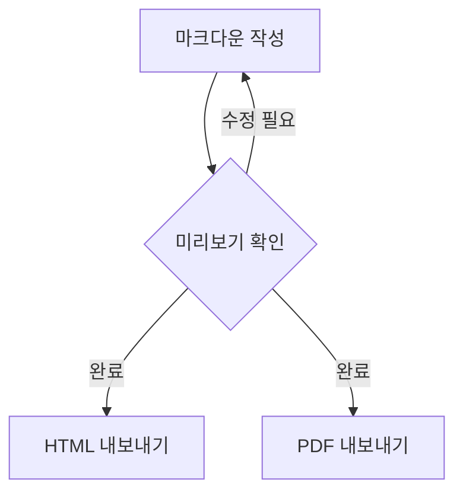

# Marksmith Demo

## 텍스트 서식

**볼드**, *이탤릭*, ~~취소선~~, `인라인 코드`

> 인용문 블록입니다.
> 여러 줄도 가능합니다.

---

## 리스트

- 항목 1
- 항목 2
  - 하위 항목 A
  - 하위 항목 B

1. 순서 1
2. 순서 2

## 체크박스

- [x] 완료된 작업
- [ ] 미완료 작업
- [ ] 다른 작업

## 코드 블록

```javascript
function greet(name) {
  console.log(`Hello, ${name}!`);
}
greet('Marksmith');
```

## 수식 (KaTeX)

인라인 수식: $E = mc^2$

블록 수식:

$$
\int_{-\infty}^{\infty} e^{-x^2} dx = \sqrt{\pi}
$$

## Mermaid 다이어그램



## 테이블

| 기능 | 상태 | 비고 |
|------|------|------|
| 미리보기 | ✅ | KaTeX + Mermaid |
| 린터 | ✅ | markdownlint |
| 포맷터 | ✅ | 자동 포맷 |
| HTML 내보내기 | ✅ | 테마 적용 |
| PDF 내보내기 | ✅ | Chromium 기반 |

## 이미지


## 링크

[VS Code Marketplace](https://marketplace.visualstudio.com/)
